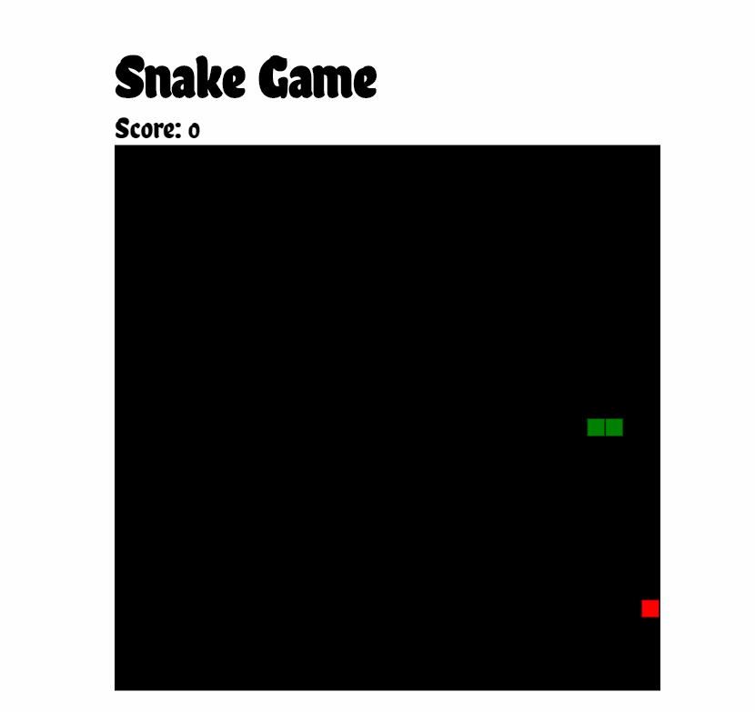

# 🐍 Snake Game 🐍

## Project Information

Recreation of the old school snake games once on the flip phones and is an old classic game. Created using HTML5 Canvas and Typescript

#### Tech Stack

| Technology   | Description                                                                           | Link ↘️                         |
| ------------ | ------------------------------------------------------------------------------------- | ------------------------------- |
| HTML5        | Hyper Text Markup Language                                                            | ----                            |
| CSS3         | Cascading Style Sheets                                                                | ----                            |
| JavaScript   | High Level, Dynamic, Interpreted Language                                             | ----                            |
| SASS         | Syntactically Awesome Style Sheets                                                    | https://sass-lang.com/          |
| Babel        | Javascript Compiler                                                                   | https://babeljs.io/             |
| Webpack      | Javascript Module Bundler                                                             | https://webpack.js.org/         |
| Browser Sync | Synchronised Browser Testing                                                          | https://www.browsersync.io/     |
| NodeJS       | Open Source, Javascript Run Time Environment, Execute Javascript code for server side | https://nodejs.org/en/          |
| Typescript   | Superset of Javascript                                                                | https://www.typescriptlang.org/ |

### Game Features

The game works as any old classic snake game, although where some games out there do not allow you to go past the board, you are able to go through the board in this game.

The rest of the rules are similar to the traditional snake game.

You will lose if the snake touches any part of its body.
